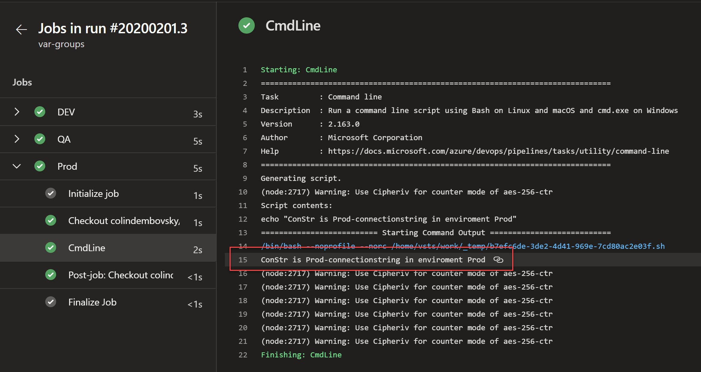

# Pipelines as Code
## Intro
I remember my first job after graduating from college – I worked for a small Internet Service Provider (ISP) that provided services such as email and anti-virus to its customers. We were using C++ and CORBA – this was before web services and REST. 
I remember Friday afternoons spent watching the build scripts slowly build our large code base. Woe to the developer that broke the build! When the build succeeded, we would all cheer, and then we’d step outside into the African sun and we would all braai (barbeque) and celebrate another successful build.

I remember how long it took me to wrap my hear around the build process. The scripts were complex, our source control was basic and though most of the process was automated, you still had to have a lot of "tribal knowledge" to get the build to work. However primitive the process was, it was my first taste of automated builds.

My second job was for a financial services company with about 20 developers. There was no such thing as automated build and deploy – we just right-click Published from Visual Studio. As you can imagine, deployment errors and failures were very common: I remember how many times someone overwrote the production web.config with the web.config from their local machine!
I knew there was a better way – and looking around I found a beta product that looked promising. It was called "Team Foundation Server (TFS) 2005". It took about a week to install in those days, but it came with source control, a build engine, work and test management.

## A Trip Down Memory Lane
The build system was a runner that executed MSBuild files – in those days it was a standard way to build .NET applications. But customizing the build process (in XML) was not particularly elegant.

When TFS 2010 shipped, it came with a Windows Workflow Foundation-based build engine. There was a User Interface (UI) editor in Visual Studio for editing the XAML definitions, and I learned how to customize the builds: it was a laborious process, requiring .NET code and uploading binaries to a shared folder under source control, adding that folder to the agent and referencing the assemblies within the custom templates – not many teams bothered to customize because of the difficulty, and those that did ended up spending too much time on "plumbing" to make customization worthwhile.

It’s also worth noting that while my team was (slowly) getting better at automated builds, there wasn’t a good way to deploy automatically. You could add a script in to push compiled code somewhere, but approvals were handled manually or through an external ticketing system. We ended up building our own release management tool.

When Microsoft released TFS 2015, it launched yet another build engine – officially called TeamBuild, but often referred to as Build vNext. This build system had a web-based UI over a JSON file and was an orchestration engine rather than a build engine. You could also create your own custom tasks if you needed to – but adding in a custom script was simple, so most custom logic ended up in simple scripts. Using TeamBuild, teams could quickly create complex workflows for building, testing and deploying their code.
In 2013, Microsoft acquired a tool called InRelease from InCycle. It was rebranded to Release Management and incorporated into TFS 2013. InRelease (and the first wave of Release Management) was a desktop application that used TFS 2013 as the backend system. Now teams could use the desktop designer to model deployment workflows, including approvals – the designer was similar to the XAML designer from XAML builds. 

These releases could be configured to trigger off build completion events, and for the first time teams had a fairly sophisticated toolchain that allowed building, testing and deploying applications. At around the same time, Microsoft released Visual Studio Online, a cloud-hosted version of Team Foundation Server. In 2015, the desktop Release Management product was superseded by an integrated web-based UI. Visual Studio Online was then rebranded to Visual Studio Team Services and later to Azure DevOps Services. Team Foundation Server was rebranded to Azure DevOps Server in late 2018.

For the remainder of this chapter, I’ll refer to Azure DevOps, but this includes Azure DevOps Server too, so whether you’re on the cloud service or hosting your own Azure DevOps Server, there’s no difference as far as pipelines as code is concerned.
While you could export the UI-based build and release definitions as JSON files, these artifacts were stored "somewhere" in the backend database of Azure DevOps and not in source control. You could see the history of changes to the definitions – but only if you looked at them in the web designer, and it was difficult to trace changes or even create any sort of approval process for changes to definitions.

Other competing build systems, like CircleCI, allowed teams to create build processes using files stored in source control. Finally, late in 2017 Microsoft released [YAML](https://yaml.org/) builds. These builds are YAML files stored in source control alongside your application code – which means they benefit from all the source control processes that application code benefit from, such as Pull Requests.

In May 2019, Microsoft added stages to YAML files allow teams to codify the entire end-to-end build, test and deploy workflow in a YAML file. At last, teams using Azure DevOps were able to codify their entire pipeline.

## Why Pipelines?
Before we launch into examining Pipelines, we should know why pipelines as code are important. Pipelines as code:
1. benefit from source control practices (such as Pull Requests)
1. can be audited for changes just like any other files in the repository
1. don’t require accessing a separate system or UI to edit
1. can fully codify the build, test and deploy process for code
1. can be templatized to empower teams to create standard processes across multiple repos

While pipelines as code – in our case, YAML builds – are powerful, they also do have a learning curve and some gotchas. Throughout this chapter I’ll call out some of these gotchas and make some recommendations about how you should think about your YAML builds. 

## Basics of Pipelines
### Agents and Queues
Before we jump into pipelines themselves, we must consider where these pipelines execute. The Azure DevOps build system is still really an orchestration engine: when a build is triggered, it finds an "agent" and tells the agent to execute the jobs (we’ll cover jobs later) defined in the pipeline file.

The agent is written in .NET Core, so it runs happily wherever .NET Core runs – Windows, Mac and Linux. Agents are registered with a queue in Azure DevOps: there are two types of queue in Azure DevOps: hosted and private.

Every Azure DevOps account has a Hosted queue with a single agent that can run one job at a time and an amount of free build minutes. Pricing is beyond the scope of this chapter, but you can purchase additional "hosted pipelines" in Azure DevOps. When you purchase an additional hosted pipeline, you’re really removing the build minutes limit and adding concurrency: one pipeline can run one job at a time, two pipelines can run two jobs simultaneously. When a pipeline is triggered or manually queued, Azure DevOps spins up an agent in Azure (either Windows, Linux or Mac, depending on which image you’ve configured to handle the pipeline) and runs the steps in the pipeline. The image is predefined by Microsoft and comes with a set of tools and SDKs preinstalled. Once the build completes, the instance is deleted.

> **TIP**: The list of software installed on the images is listed on [this repo](https://github.com/actions/virtual-environments/tree/master/images). Click into the platform folder and examine the README.md files.

There are also private pipelines and agents. If your build requires dependencies that are not installed on the hosted agent you have two choices: add a step that installs the dependency on a hosted agent. If this only take a few seconds, you’re good to go. Remember, each build starts off with a clean instance, so this step will be executed on every build – so long running install processes won’t work here. Your other option is to create a build machine, install your dependencies and then install the Azure DevOps agent on this machine – this is a private agent.

If you need to access resources that are not publicly accessible, such as Artifactory or SonarQube on your corporate network, or you’re deploying to private servers, then you’ll also need to create a private agent.

When you install an agent, you register the agent with a private queue. You can install as many agents onto a queue as you want – but you should only install one agent per core on a build machine. When a pipeline is queued onto a private queue, Azure DevOps will find an idle agent on that queue and offload the job to that agent. However, irrespective of how many agents you have on a queue, you still must pay for concurrency. If you want to run ten jobs at the same time, you’ll need 10 pipelines and at least 10 agents. If you only have one queue and 10 agents, you still only get one job running at a time!

> **TIP**: If you have multiple build machines and want to target specific machines for specific jobs, you can specify demands on the agent and in the pipeline. When the pipeline is queued, Azure DevOps will look for idle agents on the target queue that match the specified demands. More information on demands can be found [here](https://docs.microsoft.com/en-us/azure/devops/pipelines/process/demands?view=azure-devops&tabs=yaml).

## Anatomy of a Pipeline

### Hello World
Let’s start off slowly and create a simple pipeline that echos "Hello World!" to the console. This wouldn’t be a proper technical chapter if it didn’t include a Hello World example. Don’t worry – we’ll get more sophisticated quickly!

```yml
name: 1.0$(Rev:.r)

# simplified trigger (implied branch)
trigger:
- master

# equivalent trigger
# trigger:
#   branches:
#     include:
#     - master
  
variables:
  name: colin
  
pool:
  vmImage: ubuntu-latest
  
jobs:
- job: helloworld
  steps:
  - script: echo "Hello, $(name)"
```

If you run this, you'll see output similar to this:


While this first example is fairly simple, it shows the anatomy of a basic pipeline. Most pipelines will have these components:

1. Name – though often this is skipped (if it is skipped, a date-based name is generated automatically)
1. Trigger – more on triggers later, but without an explicity trigger, there’s an implicit "trigger on every commit to any path from any branch in this repo"
1. Variables – these are "inline" variables (more on other types of variables later)
1. Job – every pipeline must have at least one job
1. Pool – you configure which pool (queue) the job must run on
1. Checkout – the "checkout: self" tells the job which repository (or repositories if there are multiple checkouts) to checkout for this job
1. Steps – the actual tasks that need to be executed: in this case a "script" task (script is an alias) that can run inline scripts

We’ll cover some other components later, such as:
1. Resources – references to other repos, either for code or for templates
1. Stages – jobs can be grouped together into logical "stages"
1. Templates – reusable jobs or sets of steps
1. Deployments – special jobs that execute against an environment
1. Download – for downloading pipeline artifacts

### Name
The variable name is a bit misleading, since the name is really the build number format. If you do not explicitly set a name format, you’ll get an integer number. This is a monotonically increasing number for run triggered off this pipeline, starting at 1. This number is stored in Azure DevOps. You can make use of this number by referencing `$(Rev)`.

To make a date-based number, you can use the format `$(Date:yyyy-mm-dd-HH-mm)` to get a build number like `2020-01-16-19-22`. To get a semantic number like `1.0.x`, you can use something like `1.0$(Rev:.r)`

> Note how the period between the last two digits is inside the `$()` dereference.

You can also dynamically set the build number if you need it to be calculated as part of the build. This is useful if you use GitFlow or some other mechanism to create build numbers. We’ll cover this scenario later when we explore dynamic variables later on.

#### Counters
We'll cover functions later, but there is one function that bears mentioning here together with the build name: `counter`. The counter function returns a number that increments for each pipeline run. `counter` has two parameters that you must specify: `prefix` and `seed`. The `seed` is the starting number and the number increments for each `prefix` you specify. For example, imagine you are using a  Semantic Versioning (SemVer) for your build number, in the format `major`.`minor`.`patch`. You can use `counter` to start patch at 0 for each major/minor version and increment for each build like so:

```yml
variables:
  major: 1
  minor: 0
  patch: $[counter(join(variables['major'], '.', variables['minor']), 0)]
  version: $[join(variables['major'], '.', variables['minor'], '.', variables['patch'])]
```

> **Note**: `join` is a function that performs a concatenation of an array of elements into a string.

The first run will result in `version` being `1.0.0`. The next run, `version` will be `1.0.1` and the next time will be `1.0.2`. Changing `minor` to 1 will cause `counter` to return 0 again (since the `prefix` is now `1.1` instead of `1.0`) so `version` will be `1.1.0`, then `1.1.1` and so on. Reverting minor back to 0 will cause `counter` to start where it left off for the `1.0` prefix (at value 3), so `version` will be `1.0.3`.

### Triggers
As mentioned before, if there is no explicit `triggers` section, then it is implied that any commit to any path in any branch will trigger this pipeline to run. You can be more explicit though using filters such as `branches` and/or `paths`.

Let’s consider this trigger:

```yml
trigger:
  branches: 
    include:
    - master
```

This trigger is configured to queue the pipeline only when there is a commit to the master branch. What about triggering for any branch except master? You guessed it: use `exclude` instead of `include`:

```yml
trigger:
  branches: 
    exclude:
    - master
```

> **TIP**: You can get the name of the branch from the variables `Build.SourceBranch` (for the full name like `refs/heads/master`) or `Build.SourceBranchName` (for the short name like `master`).

What about a trigger for any branch with a name that starts with `topic/` and only if the change is in the `webapp` folder?

```yml
trigger:
  branches: 
    include:
    - feature/*
  paths:
    include:
    - webapp/**
```

Of course, you can mix includes and excludes if you really need to. You can also filter on `tags`.

> **TIP**: Don't forget one overlooked trigger: `none`. If you never want your pipeline to trigger automatically, then you can use `none`. This is useful if you want to create a pipeline that is only manually triggered.

There are other triggers for other events such as:
1. Pull Requests (PRs), which can also filter on branches and paths
1. Schedules, which allow you to specify cron expressions for scheduling pipeline runs
1. Pipelines, which allow you to trigger pipelines when other pipelines complete, allowing pipeline chaining

You can find all the documentation on triggers [here](https://docs.microsoft.com/en-us/azure/devops/pipelines/build/triggers?view=azure-devops&tabs=yaml).

> **TIP**: If you have a small repo that contains only a single application or component, then you probably don't need branch filters. Branch filters are much more important for mono repos (that is a repo that contains multiple applications or components). If you have all your source in a single repo, then you may still want multiple pipelines that build parts of the repo. This is when you should use path filters.

### Jobs
A job is a set of steps that are excuted by an agent in a queue (or pool). Jobs are atomic – that is, they are executed wholly on a single agent. You can configure the same job to run on multiple agents at the same time, but even in this case the entire set of steps in the job are run on every agent. If you need some steps to run on one agent and some on another, you’ll need two jobs.

A job has the following attributes besides its name:
1. displayName – a friendly name
1. dependsOn - a way to specify dependencies and ordering of multiple jobs
1. condition – a binary expression: if this evaluates to true, the job runs; if false, the job is skipped
1. strategy - used to control how jobs are parallelized
1. continueOnError - to specify if the remainder of the pipeline should continue or not if this job fails
1. pool – the name of the pool (queue) to run this job on
1. workspace - managing the source workspace
1. container - for specifying a container image to execute the job in - more on this later
1. variables – variables scoped to this job
1. steps – the set of steps to execute
1. timeoutInMinutes and cancelTimeoutInMinutes for controlling timeouts
1. services - sidecar services that you can spin up to augment this job, such as spinning up a database container for integration tests

There are two major types of job: `job` and `deployment`. Deployments are a specialization of jobs that add some extra metadata and are intended for - you guessed it - _deployment_ jobs.

### Dependencies
You can define dependencies between jobs using the `dependensOn` property. This lets you specify sequences and fan-out and fan-in scenarios. If you do not explicitly define a dependency, a sequential dependency is implied. If you truly want jobs to run in parallel, you need to specify `dependsOn: none`.

Let's look at a few examples. Consider this pipeline:

```yml
jobs:
- job: A
  steps:
  # steps ommited for brevity

- job: B
  steps:
  # steps ommited for brevity
```

Because no `dependsOn` was specified, the jobs will run sequentially: first `A` and then `B`.

To have both jobs run in parallel, we just add `dependsOn: none` to job `B`:

```yml
jobs:
- job: A
  steps:
  # steps ommited for brevity

- job: B
  dependsOn: none
  steps:
  # steps ommited for brevity
```

If we want to fan out and fan in, we can do that too:

```yml
jobs:
- job: A
  steps:
  - script: echo 'job A'

- job: B
  dependsOn: A
  steps:
  - script: echo 'job B'

- job: C
  dependsOn: A
  steps:
  - script: echo 'job C'

- job: D
  dependsOn:
  - B
  - C
  steps:
  - script: echo 'job D'

- job: E
  dependsOn:
  - B
  - D
  steps:
  - script: echo 'job E'
```

This will produce the following graph:


> **Note**: Later we will discuss stages which allow jobs to be grouped into logical stages. Stages also have dependencies, and they work in exactly the same way as job dependencies.

### Checkout
Classic builds implicitly checkout any repository artifacts, but pipelines require you to be more explicit using the `checkout` keyword:
- Jobs check out the repo they are contained in automatically unless you specify `checkout: none`.
- Deployment jobs do not automatically check out the repo, so you'll need to specify `checkout: self` for deployment jobs if you want to get access to files in the YAML file's repo.

### Download
Downloading artifacts requires you to use the `download` keyword. Downloads also work the opposite way for jobs and dpeloyment jobs:
- Jobs do not download anything unless you explicitly define a `download`
- Deployment jobs implicitly perform a `download: current` which downloads any pipeline artifacts that have been created in the current pipeline. To prevent this, you must specify `download: none`.

### Resources
What if your job requires source code in another repository? You’ll need to use `resources`. Resources let you reference:
1. other repositories
1. pipelines
1. builds (classic builds)
1. containers (for container jobs)
1. packages

To reference code in another repo, specify that repo in the `resources` section and then reference it via its alias in the `checkout` step:

```yml
resources:
  repositories:
  - repository: appcode
    type: git
    name: otherRepo

steps:
- checkout: appcode
```

### Steps are Tasks
Steps are the actual "things" that execute, in the order that they are specified in the job. Each step is a task: there are out of the box (OOB) tasks that come with Azure DevOps, many of which have aliases, and there are tasks that get installed to your Azure DevOps account via the marketplace.

Creating custom tasks is beyond the scope of this chapter, but you can see how to create your own custom tasks [here](https://docs.microsoft.com/en-us/azure/devops/extend/develop/add-build-task?view=azure-devops).

## Variables
It would be tough to achieve any sort of sophistication in your pipelines without variables. There are several types of variables, though this classification is partly mine and pipelines don’t distinguish between these types. However, I’ve found it useful to categorize pipeline variables to help teams understand some of the nuances that occur when dealing with them.

Every variable is really a key:value pair. The key is the name of the variable, and it has a value.

To dereference a variable, simply wrap the key in `$()`. Let’s consider this simple example:

```yml
variables:
  name: colin
steps:
-	script: echo "Hello, $(name)!"
```

This will write `Hello, colin!` to the log.

### Inline Variables
These are variables that are hard coded into the pipeline YAML file itself. Use these for specifying values that are not sensitive and that are unlikely to change. A good example is an image name: let’s imagine you have a pipeline that is building a Docker container and pushing that container to a registry. You are probably going to end up referencing the image name in several steps (such as tagging the image and then pushing the image). Instead of using a value in-line in each step, you can create a variable and use it multiple times. This keeps to the DRY (Do not Repeat Yourself) principle and ensures that you don’t inadvertently misspell the image name in one of the steps. In the following example, we create a variable called `imageName` so that we only have to maintain the value once rather than in multiple places:

```yml
trigger:
- master

pool:
  vmImage: ubuntu-latest

variables:
  imageName: myregistry/api-image

steps:
- task: Docker@2
  displayName: Build an image
  inputs:
    repository: $(imageName)
    command: build
    Dockerfile: api/Dockerfile

- task: Docker@2
  displayName: Push image
  inputs:
    containerRegistry: $(ACRRegistry)
    repository: $(imageName)
    command: push
    tags: $(Build.BuildNumber)
```

> **Note**: obviously you cannot create "secret" inline variables. If you need a variable to be secret, you’ll have to use pipeline variables, variable groups or dynamic variables.

### Predefined Variables
There are several predefined variables that you can reference in your pipeline. Examples are:
- Source branch: `Build.SourceBranch`
- Build reason: `Build.Reason`
- Artifact staging directory: `Build.ArtifactStagingDirectory`

You can find a full list of predefined variables [here](https://docs.microsoft.com/en-us/azure/devops/pipelines/build/variables?view=azure-devops&tabs=yaml).

### Pipeline Variables
Pipeline variables are specified in Azure DevOps in the pipeline UI when you create a pipeline from the YAML file. These allow you to abstract the variables out of the file. You can specify defaults and/or mark the variables as "secrets" (we’ll cover secrets a bit later). This is useful if you plan on triggering the pipeline manually and want to set the value of a variable at queue time.

> **Note**: if you specify a variable in the YAML variables section, you cannot create a pipeline variable with the same name. If you plan on using pipeline variables, you must **not** specify them in the "variables" section.

When should you use pipeline variables? These are useful if you plan on triggering the pipeline manually and want to set the value of a variable at queue time. Imagine you sometimes want to build in `DEBUG` and other times in `RELEASE`: you could specify `buildConfiguration` as a pipeline variable when you create the pipeline, giving it a default value of `debug`:


If you specify `Let users override this value when running this pipeline` then users can change the value of the pipeline when they manually queue it. Specifying `Keep this value secret` will make this value a secret (Azure DevOps will mask the value).

Let's look at a simple pipeline that consumes the pipeline variable:

```yml
name: 1.0$(Rev:.r)

trigger:
- master

pool:
  vmImage: ubuntu-latest
  
jobs:
- job: echo
  steps:
  - script: echo "BuildConfiguration is $(buildConfiguration)"
```

Running the pipeline without editing the variable produces the following log:


> **Tip**: If the pipeline is not manually queued, but triggered, any pipeline variables default to the value that you specify in the parameter when you create it.

If we update the value when we queue the pipeline to `release`, of course the log reflects the new value:


> **Note**: referencing a pipeline variable is exactly the same as referencing an inline variable – once again, the distinction is purely for discussion.

### Secrets
At some point you’re going to want a variable that isn’t visible in the build log: a password, an API Key etc. As I mentioned earlier, inline variables are never secret. You must mark a pipeline variable as secret in order to make it a secret, or you can create a dynamic variable that is secret.

"Secret" in this case just means that the value is masked in the logs. It is still possible to expose the value of a secret if you really want to. A malicious pipeline author could `echo` a secret to a file and then open the file to get the value of the secret.

All is not lost though: you can put controls in place to ensure that nefarious developers cannot simply run updated pipelines – you should be using Pull Requests and Branch Policies to review changes to the pipeline itself (an advantage to having pipelines as code). The point is, you still need to be careful with your secrets!

### Dynamic Variables and Logging Commands
Dynamic variables are variables that are created and/or calculated at run time. A good example is using the `az cli` to retrieve the connection string to a storage account so that you can inject the value into a web.config. Another example is dynamically calculating a build number in a script.

To create or set a variable dynamically, you can use [logging commands](https://docs.microsoft.com/en-us/azure/devops/pipelines/scripts/logging-commands?view=azure-devops&tabs=bash). Imagine you need to get the username of the current user for use in subsequent steps. Here’s how you can create a variable called `currentUser` with the value:

```yml
- script: |
    curUser=$(whoami)
    echo "##vso[task.setvariable variable=currentUser;]$curUser"
```

> **Tip**: when writing bash or PowerShell commands, don’t confuse `$(var)` with `$var`. `$(var)` is interpolated by Azure DevOps when the step is executed, while `$var` is a bash or PowerShell variable. I often use `env` to create environment variables rather than dereferencing variables inline. For example, I could write:

```yml
- script: echo $(Build.BuildNumber)
```

but I can also use environment variables:

```yml
- script: echo $buildNum
  env:
    buildNum: $(Build.BuildNumber)
```

This may come down to personal preference, but I’ve avoided confusion by consistently using env for my scripts!

> **Tip**: `env` works for PowerShell tasks too! However, you have to dereference using `$env:VAR`.

To make the variable a secret, simple add `issecret=true` into the logging command:

```yml
echo "##vso[task.setvariable variable=currentUser;issecret=true]$curUser"
```

You could do the same thing using PowerShell:
```yml
- powershell: |
    Write-Host "##vso[task.setvariable variable=currentUser;]$env:UserName"
```

> **Tip**: There are two flavors of PowerShell: `powershell` is for Windows and `pwsh` is for PowerShell Core which is cross-platform (so it can run on Linux and Mac!). 

One special case of a dynamic variable is a calculated build number. For that, calculate the build number however you need to and then use the `build.updatebuildnumber` logging command:

```yml
- script: |
    buildNum=$(...)  # calculate the build number somehow
    echo "##vso[build.updatebuildnumber]$buildNum"
```

Other logging commands are documented [here](https://docs.microsoft.com/en-us/azure/devops/pipelines/scripts/logging-commands?view=azure-devops&tabs=bash#build-commands).

### Variable Groups
Creating inline variables is fine for values that are not sensitive and that are not likely to change very often. Pipeline variables are useful for pipelines that you want to trigger manually. But there is another option that is particularly useful for multi-stage pipelines (we'll cover these in more detail later).

Imagine you have a web application (that connects to a database) that you want to build and then push to DEV, QA and Prod environments. Let's consider just one config setting - the database connection string. Where should you store the value for the connection string? Perhaps you could store the DEV connection string in source control, but what about QA and Prod? You probably don't want those passwords stored in source control.

You could create them as pipeline variables - but then you'd have to prefix the value with an environment or something to distinguish the QA value from the Prod value. What happens if you add in a STAGING environment? What if you have other settings like API Keys? This can quickly become a mess.

This is what Variable Groups are designed for. You can find variable groups in the `Library` hub in Azure DevOps:


The image above shows two variable groups: one for DEV and one for QA. Let's create a new one for Prod, specifying the same variable name (`ConStr`) but this time entering in the value for Prod:


> **Note**: Security is beyond the scope of this chapter - but you can specify who has permission to view/edit variable groups, as well as which pipelines are allowed to consume them. You can of course mark any value in the variable group as secret by clicking the padlock icon next to the value.

> **Tip**: The trick to making variable groups work for environment values is to keep the names the same in each variable group. That way the only setting you need to update between environments is the variable group name. I suggest getting the pipeline to work completely for one environment, and then `Clone` the variable group - that way you're assured you're using the same variable names.

#### KeyVault
You can also integrate variable groups to Azure KeyVaults. When you create the variable group, instead of specifying values in the variable group itself, you connect to a KeyVault and specify which keys from the vault should be synchronized when the variable group is instantiated in a pipeline run:


#### Consuming Variable Groups
Now that we have some variable groups, we can consume them in a pipeline. Let's consider this pipeline:

```yml
trigger:
- master

pool:
  vmImage: ubuntu-latest
  
jobs:
- job: DEV
  variables:
  - group: WebApp-DEV
  - name: environment
    value: DEV
  steps:
  - script: echo "ConStr is $(ConStr) in enviroment $(environment)"

- job: QA
  variables:
  - group: WebApp-QA
  - name: environment
    value: QA
  steps:
  - script: echo "ConStr is $(ConStr) in enviroment $(environment)"

- job: Prod
  variables:
  - group: WebApp-Prod
  - name: environment
    value: Prod
  steps:
  - script: echo "ConStr is $(ConStr) in enviroment $(environment)"
```

When this pipeline runs, we see the DEV, QA and Prod values from the variable groups:




> **Note**: The format for inline variables alters slightly when you have variable groups - you have to use the `- name/value` format.

This example demonstrates a couple of things:
1. Integration with variable groups
1. Job variables - that is, jobs can have variables too, not just pipelines
1. You can specify multiple jobs in a single pipeline - in fact, as we'll see later, pipelines can have multiple stages, and each stage can have multiple jobs.

What you may have noticed is that every job has the same steps - so there is plenty of copy/paste going on here! Surely there's a better way to repeat common steps? Yes, there is a btter way - we are creating code, after all! Enter templates...

## Templates
Templates are like _functions_ - they allow reuse and much better maintainability. There are two types of templates: _step_ templates and _job_ templates. 

### Step Templates
Let's consider the previous example pipeline. Each job had exactly the same `steps` section:

```yml
  steps:
  - script: echo "ConStr is $(ConStr) in enviroment $(environment)"
```

What if we created a template for the common steps so that we only had to maintain it in a single place? All we have to do is place the steps into a separate steps YAML file - and we can even parameterize the template:

```yml
# templates/steps.yml
parameters:
  owner: ''

steps:
- script: echo "ConStr is $(ConStr) in enviroment $(environment) and is owned by ${{ parameters.owner }}"
```

This should look familiar: but it is slightly different. The primary difference is the way that parameters are dereferenced, using `${{}}` notation, which is different from the way variables are deferenced using `$()`. We'll discuss the differences between parameters and variables in more detail later.

Given this template, we can update the main pipeline:
```yml
trigger:
- master

pool:
  vmImage: ubuntu-latest
  
jobs:
- job: DEV
  variables:
  - group: WebApp-DEV
  - name: environment
    value: Dev
  steps:
  - template: templates/webapp-steps.yml
    parameters:
      owner: Dylan

- job: QA
  variables:
  - group: WebApp-QA
  - name: environment
    value: QA
  steps:
  - template: templates/webapp-steps.yml
    parameters:
      owner: Bob

- job: Prod
  variables:
  - group: WebApp-Prod
  - name: environment
    value: Prod
  steps:
  - template: templates/webapp-steps.yml
    parameters:
      owner: Sally
```

As expected, the output for the QA environment is showing all the QA-specific values, both for the variables as well as the parameter:


Of course the step template is now longer than the original step was - but what if you had 5 or 6 steps? Step templates allow you to maintain those steps in one place and make them reusable.

We can also create job templates.

### Job Templates
Job templates are essentially the same as step templates - but they allow us to specify entire jobs, not just sets of steps, as a template. This is particularly useful for deployment scenarios, where we want to use the same job to deploy to multiple environments, just with environment-specific values. This is touching on multi-stage pipelines, which we'll get to shortly. For now, let's look at what you can do with job templates.

```yml
# templates/deploy-webapp.yml
parameters:
  pool: {}
  environmentName: 'dev'
  azureSubscription: ''
  appName: 'mywebapp'
  containerRegistry: 'myacr'
  imageRepo: 'webapp'
  tag: '$(Build.BuildNumber)'

jobs:
- job: deploy
  displayName: 'Deploy to ${{ parameters.environmentName }}'
  pool: ${{ parameters.pool }}
  steps:
  - task: AzureWebAppContainer@1
    displayName: 'Azure Web App on Container Deploy'
    inputs:
      azureSubscription: '${{ parameters.azureSubscription }}'
      appName: '${{ parameters.appName }}'
      containers: '${{ parameters.containerRegistry }}/${{ parameters.imageRepository }}:${{ parameters.tag }}'
```

This template defines a job that can be executed. There are also some interesting parameters:
- Instead of hard-coding the `pool`, the pool can be passed in as a parameter, allowing us to run this job on any queue that has the `AzureWebAppContainer` task prerequisites installed
- The Azure subscription is parameterized, since we probably have different subscriptions for different environments (more on _service connections_ later)
- The `environmentName`, `appName`, `containerRegistry`, `imageRepo` and `tag` parameters all specify defaults

We could now have a DEV pipeline and a PROD pipeline:

```yml
# dev-deploy.yml
trigger:
  branches: 
    exclude:
    - master

jobs:
- job: templates/deploy-webapp.yml
  parameters:
  pool: 
    name: my-private-ubuntu-queue  # this is a private queue
    azureSubscription: 'My-Dev-AzureSubscription'
```

```yml
# prod-deploy.yml
trigger:
  branches: 
    include:
    - master

jobs:
- job: templates/deploy-webapp.yml
  parameters:
  pool: 
    vmImage: ubuntu-latest  # use the hosted queue
    environmentName: PROD
    azureSubscription: 'My-PROD-AzureSubscription'
```

Later when we discuss multi-stage pipelines we'll see how we can create a single pipeline with multiple stages rather than having a pipeline per environment.

### Variable Templates
There is another type of template that can be useful - if you have a set of inline variables that you want to share across multiple pipelines, you can create a template. The template can then be referenced in multiple pipelines:

```yml
# templates/variables.yml
variables:
- name: buildConfiguration
  value: debug
- name: buildArchitecture
  value: x64
```

```yml
# pipelineA.yml
variables:
- template: templates/variables.yml
steps:
- script: build x ${{ variables.buildArchitecture }} ${{ variables.buildConfiguration }}
```

```yml
# pipelineB.yml
variables:
- template: templates/variables.yml
steps:
- script: echo 'Arch: ${{ variables.buildArchitecture }}, config ${{ variables.buildConfiguration }}'
```

### Precedence and Expansion
Variables can be defined at various scopes in a pipeline. When you define a variable with the same name at more than one scope, you need to be aware of the precedence. You can read the documentation on precedence [here](https://docs.microsoft.com/en-us/azure/devops/pipelines/process/variables?view=azure-devops&tabs=yaml%2Cbatch#expansion-of-variables).

You should also be aware of _when_ variables are expanded. They are expanded at the beginning of the run, as well as before each step. This example shows how this works:

```yml
jobs:
- job: A
  variables:
    a: 10
  steps:
    - bash: |
        echo $(a)    # This will be 10
        echo '##vso[task.setvariable variable=a]20'
        echo $(a)    # This will also be 10, since the expansion of $(a) happens before the step
    - bash: echo $(a)        # This will be 20, since the variables are expanded just before the step
```

### Variables vs Parameters
We've seen variables and parameters in use so far. However, there are actually three ways to dereference variables. The official documentation calls these three methods macros, template expressions and runtime expressions.

When you use `$()` to refer to a variable, you're using the macro syntax. Template parameters use the `${{}}` sytax. The [official documentation](https://docs.microsoft.com/en-us/azure/devops/pipelines/process/variables?view=azure-devops&tabs=yaml%2Cbatch#understand-variable-syntax) describes these three methods of deferencing. In practice, I've almost never had to use the runtime expressions, which have the format `$[variables.var]`.

In practice, the main thing to bear in mind is _when the value is injected_. `$()` variables are expanded at runtime, while `${{}}` are expanded at compile time. Knowing this rule can save you some headaches.

The other notable difference is left vs right side: variables can only expand on the right side, while parameters can expand on left or right side. For example:

```yml
# valid syntax
key: $(value)
key: $[variables.value]
${{ parameters.key }} : ${{ parameters.value }}

# invalid syntax
$(key): value
$[variables.key]: value
```

> **Note**: If you try to reference a variable `$(foo)` and no value can be found, it is rendered as the literal string `$(foo)`. If you reference a parameter `${{ parameters.bar }}` or a runtime variable `$[variables.baz]` and no corresponding value can be found, they are rendered as an empty string.

One final difference between variables and parameters: variables can only be strings, while parameters can be complex objects. The official syntax for variables and parameters is as follows:

```yml
variables: { string: string }

parameters: { string: any }
```

Here's a real-life example from a [TailWind Traders pipeline](https://github.com/10thmagnitude/TailwindTraders-Backend/blob/master/Pipeline/azure-pipeline.yaml) I created. In this case, the repo contains several microservices that are deployed as Kubernetes services using Helm charts. Even though the code for each microservice is different, the _deployment_ for each is identical, except for the path to the Helm chart and the image repository.

Thinking about this scenario, I wanted a template for deployment steps that I could parameterize. Rather than copy the entire template, I used a `for` expression to iterate over a map of complex properties (we'll cover expressions in the next section). For each service deployment, I wanted:
- `serviceName`: The path to the service Helm chart
- `serviceShortName`: Required because the deployment requires two steps: `bake` the manifest, and then `deploy` the baked manifest. The `deploy` task references the outout of the `bake` step, so I needed a name that wouldn't collide as I expanded it multiple times in the `for` loop. Here's a snippet of the template steps:

```yml
# templates/step-deploy-container-service.yml
parameters:
  serviceName: ''  # product-api
  serviceShortName: '' # productapi
  environment: dev
  imageRepo: ''  # product.api
  ...
  services: []

steps:
- ${{ each s in parameters.services }}:
  - ${{ if eq(s.skip, 'false') }}:
    - task: KubernetesManifest@0
      displayName: Bake ${{ s.serviceName }} manifest
      name: bake_${{ s.serviceShortName }}
      inputs:
        action: bake
        renderType: helm2
        releaseName: ${{ s.serviceName }}-${{ parameters.environment }}
        ...
    - task: KubernetesManifest@0
      displayName: Deploy ${{ s.serviceName }} to k8s
      inputs:
        manifests: $(bake_${{ s.serviceShortName }}.manifestsBundle)
        imagePullSecrets: $(imagePullSecret)
```

Here's a snippet of the pipeline that references the template:

```yml
# pipeline.yml
...
  - template: templates/step-deploy-container-service.yml
    parameters:
      acrName: $(acrName)
      environment: dev
      ingressHost: $(IngressHost)
      tag: $(tag)
      autoscale: $(autoscale)
      services:
      - serviceName: 'products-api'
        serviceShortName: productsapi
        imageRepo: 'product.api'
        skip: false
      - serviceName: 'coupons-api'
        serviceShortName: couponsapi
        imageRepo: 'coupon.api'
        skip: false
      ...
      - serviceName: 'rewards-registration-api'
        serviceShortName: rewardsregistrationapi
        imageRepo: 'rewards.registration.api'
        skip: true
```

In this case, `services` could not have been a variable since variables can only have `string` values. Hence I had to make it a parameter.

### Expressions
There are a number of expressions that allow us to create more complex scenarios. The example above uses both the `for` and the `if` expressions, along with the boolean function `eq`. Expressions can be used to loop over steps or ignore steps (as an equivalent of setting the `condition` property to `false`). Let's look at an example in a bit more detail:

```yml
# templates/steps.yml
parameters:
  services: []

steps:
- ${{ each s in parameters.services }}:
  - ${{ if eq(s.skip, 'false') }}:
    - script: echo 'Deploying ${{ s.name }}'
```

If specify the following pipeline:
```yml
jobs:
- job: deploy
  - steps: templates/steps.yml
    parameters:
      services:
      - name: foo
        skip: false
      - name: bar
        skip: true
      - name: baz
        skip: false
```

we should get the following output from the steps:

```
Deploying foo
Deploying baz
```

We can use expressions to inject steps. Imagine you have a set of steps that you want to repeat with different parameters - except that in some cases, a slightly different middle step needs to be executed. You can create a template that has a parameter called `middleSteps` where you can pass in the middle step!

```yml
# templates/steps.yml
parameters:
  environment: ''
  middleSteps: []

steps:
- script: echo 'Prestep'
- ${{ parameters.middleSteps }}
- script: echo 'Post-step'
```

```yml
# pipelineA
jobs:
- job: A
  - steps: templates/steps.yml
    parameters:
      middleSteps:
      - script: echo 'middle A step 1'
      - script: echo 'middle A step 2'
```

```yml
# pipelineB
jobs:
- job: B
  - steps: templates/steps.yml
    parameters:
      middleSteps:
      - script: echo 'This is job B middle step 1'
      - task: ...  # some other task
      - task: ...  # some other task
```

> **Note**: For a real world example of this, see this [template file](https://github.com/10thmagnitude/MLOpsDemo/blob/master/templates/job-train-model.yml). This is a demo where I have two scenarios for machine learning: a manual training process and an AutoML training process. The pre-training and post-training steps are the same, but the training steps are different: the template reflects this scenario by allowing me to pass in different `TrainingSteps` for each scenario.

> **Note**: The complete list of functions like `eq`, `join`, `contains` and so on can be found [here](https://docs.microsoft.com/en-us/azure/devops/pipelines/process/expressions?view=azure-devops#functions).

## Multi-Stage Pipelines
Of course pipelines can be used to build, unit test, scan and package applications. When you trigger these actions off a commit, you get Continuous Integration (CI). But what about spinning up infrastructure and deploying applications? This is the realm of Continuous Deployment (CD).

Pipelines as Code allow us to define, in code that's in source control, the entire end-to-end process of building and deploying applications:
- Compiling source code
- Unit testing
- Static code analysis
- Packaging
- Creating/updating infrastructure through infrastructure as code
- Deploying applications
- Functional and performance testing

I like to coach teams to think of two major processes: _build_ and _deploy_. When you build, you want to take source code as an input and compile, scan, test and package an application. This process should be entirely _environment agnostic_: that is, there should be no dependency on any environment at all. This is why unit tests should never have dependencies on external systems like databases or external services - these should be mocked, stubbed or faked. The output of the build process should be a _binary that is potentially deployable to any environment_.

The second process - deployment - should take as inputs a package from a build and any scripts that are necessary to deploy the package. This process is _environment aware_: this is the place where connection strings and URLs should be configured for the target environment. After deployment, functional and performance testing should be automated. These are run here and not in the build since these tests require environments.

When Team Build (Build vNext) was first released it was really a build engine. You could deploy from the build, but if you wanted to deploy to multiple environments you really had to make use of Release Management. These two tools reflected the two processes above: build and deploy. Pipelines allows you to model the entire pipeline (both processes) in a single file. You could create multiple pipelines if you wanted to keep these strictly separate, but even if you only have a single file, stick to keeping the processes separate.

A multi-stage pipeline allows you to create a pipeline with multiple stages. Stages can have dependencies just like job dependencies so you can model how stages execute in relation to one another. Each stage is made up of one or more jobs.

Astute readerw may ask: Why not simply model the pipeline as a series of jobs? You certainly could - but stages do give other features that jobs don't have: approvals (or checks) and environments. Each stage can (optionally) be configured to execute against an _environment_. Additionally, each stage can (optionally) define approvals before the jobs in the stage execute.

### Environments; 
Environments, at their most basic, are loosely defined logical constructs. An environment could be a group of machines or a Kubernetes namespace or a resource group in Azure. Some environments are more "aware" than others. As of February 2020, when you create an environment, you can create one of three types of environment:
1. **Kubernetes**: this is an environment that is tied to a namespace in a Kubernetes cluster
1. **Virtual Machines**: this is an environment made up of VMs
1. **None**: this is a catch-all generic environment that represents a logical environment

By "aware", I mean that Azure DevOps will track the status of the resources within the environment. This awareness allows Pipelines to wait on resources to come up before moving on - a feature you don't get in the "None" environments. Kubernetes environments are "aware" of some of the resources (like Services, Deployments and Pods) within them. VM environments are "aware" of the VMs within the environment. For Kubernetes environments, you can see workloads within the environment and even connect to logs and consoles in real time.

Environments also allow you to view deployments to the environment, as well as incoming commits and/or work items. You can read more about defining environments [here](https://docs.microsoft.com/en-us/azure/devops/pipelines/process/environments?view=azure-devops).

Whichever environment type you end up using, this is the place where you can define approvals. Imagine you're modelling a typical pipeline with four stages: Build -> Dev -> Staging -> Prod. You may want the Dev stage to start immediately after the Build stage so that you always have the latest code deployed to Dev. However, you probably don't want Staging or Prod to simply start when the previous stage is completed: you probably want some sort of manual approval first.

#### Checks
Approvals are interesting in the world of Pipelines as Code. Think about where they should be defined. In the pipeline itself? That would mean I could update the approval in the code and make myself an approver, or remove approvals altogether. However, the Pipelines engineers decided to abstract the approvals out of the code and into another construct: environments. When we configure an environment, we can configure approvals by defining Checks.


> **Note**: Release Management (classic pipelines) has a feature called [Gates](https://docs.microsoft.com/en-us/azure/devops/pipelines/release/approvals/gates?view=azure-devops), which are automated checks. As of February 2020, it is not possible to create automated checks for environments. You can, however, create [artifact policy checks](https://docs.microsoft.com/en-us/azure/devops/pipelines/process/artifact-policy?view=azure-devops) for container images deploying to Kubernetes environments.

### Service Connections
Environments abstract the checks and resources for a pipeline away from the pipeline itself. There is one other construct that we need to abstract away from the pipeline: _authentication_. Again, let's reason this one out: let's say you want to deploy to an Azure Web Application. You probably need some sort of authentication and authorization to do so! Let's say that you create a Service Principle and give it permission to deploy. How do you authenticate using those credentials in the pipeline? You may store the Service Principle ID in the code, but you certainly don't want to store the key in source control!

Azure DevOps solves this dilemma for us by offering Service Connections (also known as Endpoints). These connections abstract authentication away from the pipelines themselves. An administrator can create an endpoint (in our example it would be an Azure Resource Group endpoint) with the credentials of the service principle:


There are many types of service connection, and you can create custom service connection types too:


Once created, the administrator can also define security on the connection - who can edit and who can consume the connection. Pipeline authors just need to have permission to consume the connection - this process is known as _authorization_. When a pipeline is triggered, it must be authorized to use the connections that it references (unless the administrator checks `Authorize endpoint for all pipelines` when creating the connection). The user who presses the Authorize button must have permissions to consume that connection for authorization to be successful.


> **TIP**: If you create a Kubernetes environment tied to a namespace, Azure DevOps creates an endpoint to that environment for you automatically.

### Deployment jobs
We have almost all the pieces we need to create a multi-stage pipeline. The final piece is a specialization of a job: a _deployment job_ (also just called a _deployment_). A deployment is a exactly the same as a job, but it targets a specific `environment` and runs its steps using a particular `strategy`. These jobs are designed for environment-aware operations, unlike jobs which are generally environment agnostic.

Strategies map to several common life cyle hooks:
- `preDeploy`: Get ready to deploy
- `deploy`: Deploy
- `routeTraffic`: Route traffic to the updated version
- `postRouteTraffic`: Test the updated version after routing traffic
- `on: error` and `on: failure`: Perform success or failure steps

Each hook can specify a set of steps that execute at that point of the life cycle.

Strategies trigger and loop life cycle hooks differently. Currently there are three supported strategies:
- [runOnce](https://docs.microsoft.com/en-us/azure/devops/pipelines/process/deployment-jobs?view=azure-devops#runonce-deployment-strategy)
- [rolling](https://docs.microsoft.com/en-us/azure/devops/pipelines/process/deployment-jobs?view=azure-devops#rolling-deployment-strategy)
- [canary](https://docs.microsoft.com/en-us/azure/devops/pipelines/process/deployment-jobs?view=azure-devops#canary-deployment-strategy)

## Advanced Topics
At this point we've covered the basics of pipelines, and even delved into some deeper concepts. In this section I want to discuss some advanced topics.

### Caching
Some steps in a pipeline may end up producing almost the same result, no matter how many times you execute them. For example, if you're using Yarn for package management, the `install` operation downloads all the referenced packages into a `.yarn` folder and then installs them into the `node_modules` folder. If you're referencing a large number of packages, this operation can take some time. What if we could cache the `.yarn` folder so that we don't have to download the packages on every build? We can by using _caching_.

Caching allows you to cache an arbitrary `path` using an arbitrary `key`. In the Yarn example, we can specify a key of "OS + yarn.lock" for example and specify `.yarn` as the path to cache. When we execute the `cache` step, Pipelines checks the cache using the key: if there is a hit, it downloads the cache to the folder. At the end of the run, the path is uploaded to Pipelines for future cache operations.

You can read more about caching [here](https://docs.microsoft.com/en-us/azure/devops/pipelines/caching/?view=azure-devops).

### Container Jobs
All the examples we've seen have defined `steps` for the agent to execute. We discussed early on the types of agents there are: private and hosted agents. The agent is really just an _orchestrator_ - so where are the steps actually executed? They're executed on the machine (or container) that the agent is running in.

Imagine you have a Node.js application that you want to compile (or transpile), test and package. In order for that to work, you'd need to have Node.js and probably npm installed and configured _on the agent_: that is on the machine that the agent is running on. The hosted agents have a set of pre-installed SDKs and utilities, and if you use only those, you can certainly use the hosted agents for the build. But if you're using some SDK or utility that is _not_ in the hosted agent, you have to create a private agent. Typically, teams create a "build machine" and install the private agent on that machine - and then install any required SDKs and utilities too.

Keeping your agent (machine) up to date can be tedious. And what if you have other projects that require other SDKs and utilities? You could install these on the same machine, but you could end up having conflicting dependencies. In this case you'd need another machine entirely.

Dependency hell - ahem, management - where have you heard that before? Ever heard of Docker? Managing dependencies is one of the reasons that containers became popular in the first place, so perhaps there is a way to leverage containers to solve this problem? And of course, there is!

The first way you can solve this problem is simply to run the agent as a Docker container. You simply create a Dockerfile with all of your prerequisites and then run the image somewhere. There is a walkthrough [here](https://docs.microsoft.com/en-us/azure/devops/pipelines/agents/docker?view=azure-devops#adding-tools-and-customizing-the-container). The challenge with this solution is that you need to create a new image and redeploy the agent each time you need to change the dependencies.

There is a more elegant solution: _container jobs_. [Container jobs](https://docs.microsoft.com/en-us/azure/devops/pipelines/process/container-phases?view=azure-devops) allow you to specify an image for the job to run in. That is, you use a "vanilla" hosted or private agent to run the pipeline. You then specify container images as `resources` in the pipeline. Then you reference the image for a job (or a step) and Azure DevOps will launch an instance of the container image _and then run the job (or step) inside that container_. This means when you have to update dependencies, you update the image but don't have to restart or redeploy the agent.

In this very simple example, the `printenv` command is run inside a container instance - this is _not_ the same instance that the agent is running on!

```yml
pool:
  vmImage: 'ubuntu-16.04'

container: ubuntu:16.04

steps:
- script: printenv
```

For a more "real-world" example, consider a pipeline that automated [Azure AutoML](https://docs.microsoft.com/en-us/azure/machine-learning/concept-automated-ml) training. In order to automate this training, you need the `az` cli (the [Azure command line interface](https://docs.microsoft.com/en-us/cli/azure/get-started-with-azure-cli?view=azure-cli-latest)) but you also need some other python libraries as well as the `azure-cli-ml` extension. Rather than install the python packages and extensions every time the build runs, I create a Docker image for executing the Azure Pipeline job. I then have a build that creates the image from the [Dockerfile](https://github.com/10thmagnitude/MLOpsDemo/blob/master/automl/docker/Dockerfile) and publishes the image to Azure Container Registry.

Now that we have the image, we can add it as a reference like so:

```yml
resources:
  containers:
  - container: mlops
    image: build/mlops:latest
    endpoint: cdk8spu-reg
```

> **Note**: The `endpoint` is a service endpoint that has credentials to my Azure Container Registry. The registry doesn't have to be in Azure - it can be any Docker registry.

We can now tell Pipelines to create an instance of the container image (a running container) and execute the job within this running image:

```yml
jobs:
- deployment: trainModel
  displayName: Train Model
  pool:
    vmImage: ubuntu-latest
  # tell Azure Pipelines to run this job in the referenced container image
  container: mlops
  steps:
  - checkout: self

  # this step requires the prerequisites that are configured in the container image
  - task: AzureCLI@2
    displayName: Upload training data
    inputs:
      azureSubscription: $(AzureSubscription)
      scriptType: bash
      scriptLocation: inlineScript
      inlineScript: |
        echo "Uploading training data"
        dataStoreName=$(az ml datastore show-default -w $WORKSPACE -g $RG --query name -o tsv)
        az ml datastore upload -w $WORKSPACE -g $RG -n $dataStoreName -p $DATAFOLDER -u $CONTAINER --overwrite true
        
        # create a variable with the datastoreName for subsequent tasks
        echo "##vso[task.setvariable variable=DataStoreName;]$dataStoreName"
    env:
      ...
```

You can see the full pipeline [here](https://github.com/10thmagnitude/MLOpsDemo/blob/master/azure-pipeline-automl.yml).

### Service Containers
We've considered using containers to manage _build_ dependencies. What about managing other dependencies? A good example is running integration tests. Imagine you have some tests that call your code, and your code has a dependency on a MySQL database. You could deploy the database and configure the connection string for the tests. However, there is a more elegant method to model service dependencies - [service containers](https://docs.microsoft.com/en-us/azure/devops/pipelines/process/service-containers?view=azure-devops&tabs=yaml).

Just as we referenced container images as resources for container jobs, we can create container services. Reference the service container image and then specify that you want an instance of the service, and optionally the port to run on. When the pipeline completes, Azure DevOps simply shuts down the service container.

Imagine you need to run nginx and redis for your test steps. The service containers documentation includes this example of how to do this:

```yml
resources:
  containers:
  - container: nginx
    image: nginx
  - container: redis
    image: redis

pool:
  vmImage: 'ubuntu-16.04'

container: ubuntu:16.04

services:
  nginx: nginx
  redis: redis

steps:
- script: |
    apt install -y curl
    curl nginx
    apt install redis-tools
    redis-cli -h redis ping
```

The job references two container images: `nginx` and `redis`. They are spun up in the `services` section, including creating networking and DNS entries in the `job` container (`ubuntu:16:04`) so that they can be accessed using `nginx` and `redis` as the hosts.

#### Container Steps
Specifying `container` for a job instructs Azure Pipelines to run the entire job inside the container. You can be more fine-grained and use a container for an individual step using the `target` keyword on a step. In the following example, a single step is run inside a container image that has JMeter installed:

```yml
resources:
  containers:
  - container: jmeter
    image: justb4/jmeter:latest

steps:
- script: echo No access to jmeter
# this step runs inside the jmeter container
- script: jmeter -n -t test.jmx ...
  target: jmeter
```

### Custom Tasks
There are dozens of out-of-the-box tasks in Azure Pipelines. There is also a rich ecosystem of extensions in the [Azure DevOps Marketplace](https://marketplace.visualstudio.com/azuredevops) that add custom tasks. I won't cover creating custom tasks in this chapter, but there is a walkthrough [here](https://docs.microsoft.com/en-us/azure/devops/extend/overview?view=azure-devops).

When should you create a custom task? Here are some guidelines I've found with regard to custom tasks:
1. Check that there are no out-of-the-box or marketplace extensions that do what you need to do. Only consider custom tasks if you can't find an existing Task or you cannot install extensions (some organizations don't allow extensions for compliance reasons).
1. Start off using a `script` task to do what you want to do.
1. If the `script` task is going to be utilized by more than one team, that's probably a good indication that it could be turned into a custom task.
1. Consider if a step (or job) template meets your needs. These templates allow you to share steps across multiple pipelines and/or teams fairly easily.
1. If you want to give authors an improved authoring experience, then create a custom task. Custom tasks allow you to specify a UI that authors can use to configure the parameters to the task (through the Task Helper).
1. Create your task using TypeScript. This ensures that your task is cross-platform.

### Decorators
[Pipeline Decorators](https://docs.microsoft.com/en-us/azure/devops/extend/develop/add-pipeline-decorator?view=azure-devops) allow you to inspect and manipulate the pipeline before it executes. You may want to run a script at the end of every pipeline. You can do this by defining a decorator that injects a step:

```yml
steps:
  - task: CmdLine@2
    displayName: 'Run my script (injected from decorator)'
    inputs:
      script: ...
```

> **Note**: This is exacly the way that the `cache` task synchronizes the cache path at the end of the pipeline, so you only add the `cache` task once instead of having to add a "download" and "upload" task.

Decorators are installed as extensions to your Azure DevOps account. Creating decorators is beyond the scope of this chapter, but you can see how to create decorators [here](https://docs.microsoft.com/en-us/azure/devops/extend/develop/add-pipeline-decorator?view=azure-devops).

### Extends Templates
Templates allow pipelines and teams to share pipeline logic. However, template authors may want to manipulate jobs, injecting or removing steps. You can do this using _extends templates_.

Imagine you want to restrict pipelines in such a manner that authors cannot run `script` tasks. The [extends templates](https://docs.microsoft.com/en-us/azure/devops/pipelines/security/templates?view=azure-devops#use-extends-templates) documentation demonstrates this using the following example:

```yml
# template.yml
parameters:
- name: usersteps
  type: stepList
  default: []
steps:
- ${{ each step in parameters.usersteps }}:
  - ${{ each pair in step }}:
    ${{ if ne(pair.key, 'script') }}:
      ${{ pair.key }}: ${{ pair.value }}
```

```yml
# azure-pipelines.yml
extends:
  template: template.yml
  parameters:
    usersteps:
    - task: MyTask@1
    - script: echo This step will be stripped out and not run!
    - task: MyOtherTask@2
```

> **Note**: The `type` keyword is used above - this keyword allows template authors to enforce [parameter type safety](https://docs.microsoft.com/en-us/azure/devops/pipelines/security/templates?view=azure-devops#type-safe-parameters).

### Securing Pipelines
Securing pipelines is a chapter all on its own. This excellent [article](https://docs.microsoft.com/en-us/azure/devops/pipelines/security/overview?view=azure-devops) explores this topic deeply. The incrental approach that this article takes is excellent and highly recommended if you're looking at securing your pipelines.

### Reporting
Analyzing a couple of pipelines is manageable - but what if you want to analyze dozens of pipelines? What if you want to determine which tasks are consuming the most agent time? You're going to need a way to report on pipelines. Fortunately, Azure DevOps includes a rich OData feed that you can use to create reports over and analyze pipelines. For examples, refer to examples like [this one](https://docs.microsoft.com/en-us/azure/devops/report/powerbi/sample-pipelines-outcome-summary?view=azure-devops&tabs=powerbi).

### Pipelines API
If you're part of a team that is authoring and managing pipelines for other teams, you may want to do more than just create templates and YAML files. Azure Pipelines has a rich API for creating, managing and triggering pipelines. This allows you to automate processes around pipelines. For example, I worked with a customer that uses ServiceNow for self-service. We modelled environments using Terraform, and created Azure Pipelines for executing the Terraform templates to create the environments. We then coded a workflow in ServiceNow that went through an approval process: once the ticket was approved, ServiceNow invoked the Azure DevOps REST API to trigger the Pipeline, passing in parameters that the ServiceNow ticket collected from the user.

You can find more information on the Pipelines API [here](https://docs.microsoft.com/en-us/rest/api/azure/devops/distributedtask/?view=azure-devops-rest-5.1).

### GitHub Actions
There is another chapter in this book dedicated to GitHub Actions. However, it's important to compare and contrast GitHub Actions (often just called Actions) with Azure Pipelines.

GitHub Actions are also YAML based. In fact, the agents that run Actions are a fork of the Azure Pipelines agent. You will notice remarkable similarity between the syntax of Pipelines and Actions. Actions can be used to model other workflows (not just CI/CD) such as tagging issues or cleaning stale issues. However, Actions only work against GitHub repos - while Pipelines can work against a wide variety of repos, including GitHub repos.

As of February 2020, there are a number of limitations to Actions. For example, there are no approvals and you cannot model stages using Actions. Actions is growing rapidly, both from within GitHub and through the community. We're likely to see a rapid increase in features for Actions.

Here is a comparison of Actions and Pipelines:

|Feature|Actions|Pipelines|
|---|---|---|
|UI Editor|No|Yes (Classic Pipelines)|
|YAML Definitions|Yes|Yes|
|Templates|No|Yes|
|Triggers for Source Control Events|Yes|Yes|
|Triggers for other events|Yes|Yes (with WebHooks)|
|Build Number|No|Yes|
|Inline Secrets|Yes|Yes|
|Variable Groups|No|Yes|
|Environments|No|Yes|
|Approvals|No|Yes|
|Metrics|No|Yes|
|Source Repo|Only GitHub|Multiple (including GitHub)|
|Marketplace|Yes|Yes|

So which should you use? For CI, you could use either Actions or Pipelines (assuming your source code is in GitHub of course). For CD, I don't (yet) recommend Actions, since there is no way to model multiple stages or environments or approvals. Actions really shines for automating non-source code events though: while you can do these using Pipelines, it's harder. Again, the only caveat is that your source code (and your events) are in GitHub.

## Lessons Learned
Throughout this chapter I've sprinked Tips that can help you to make the most of Pipelines. I want to end off by considering some of the top lessons learned and recommendations that I have about Pipelines as Code.

### Templates, Templates, Templates
Templates give you the ability to have _enterprise alignment_ but also _team autonomy_. They align teams because templates are a standard way to build or test or deploy. In an ideal world, teams would have very few steps in their pipelines: their pipelines would just be references to common templates with application and environment-specific values. Templates promote the DRY (Don't Repeat Yourself) principle and reduce the amount of maintenance overhead. Teams that are trying to change culture and improve collaboration should use templates as a forcing function.

### Configuration and Secrets
I've covered variables deeply in the Variables section, but I wanted to discuss them again here in lessons learned. Since there are multiple places where configuration and secrets can be stored, teams should consider where they want to do so. Secrets should **never** be stored in source control - use Variable Groups, Pipeline Variables or Azure KeyVault to store them. But what about other configuration? Is it better to store these in the pipeline in code or outside of the pipeline? There are many factors affecting this decision, such as history. If you want to see who changed a value when, you probably want to define the values inline since you'll be able to see the changes to the value in source control history. However, if you want the values to be changed without having to create a PR, then you probably want to store them outside the pipeline.

### Segregation of Duty
One of the problems that DevOps aims to solve is reducing siloes. We know that Dev and Ops typically operated in siloes, and that these siloes stifled collaboration and created waste by adding in queues. These siloes are often reinforced by "segregation of duty". Some industries enforce this through regulation, but often teams are just used to this way of working.

As teams adopt good DevOps, including multi-disciplinary teams, siloes start disappearing and handoffs are eliminated. Pipelines as Code is critical in this transformation since it is a place where Ops-focused people can define process and infrastructure, while Dev-focused people can define applicaiton build/deploy/configure processes. When both build and deploy processes are modeled in the same pipeline, teams are forced to collaborate in a shared space: the tool enables the culture teams should be aiming for.

> **Note**: If you're at all interested in a little psychology, this is called a Reverse Conway Maneuver. You can read about this in this [blog post](https://colinsalmcorner.com/post/vsts-one-team-project-and-inverse-conway-maneuver).

Segregation of Duty can still be enforced in a fairly unobtrusive manner with Pipelines:
1. Ensure that every merge to master requires a Pull Request (PR) - this enforces code review
1. While you can build off any branch, you should only deploy packages that come from the master branch
1. Separate the folks who create environments and Checks from Pipeline authors
1. Separate the folks who administer endpoints from Pipeline authors

## Conclusion
Pipelines as Code are an essential tool and process to master for successful DevOps. Azure Pipelines provides a rich syntax and orchestration engine that allows you to model complex build, test, package, analyze, provision and configuration processes.
